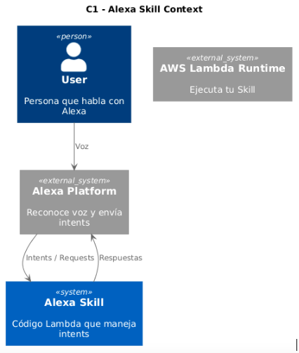
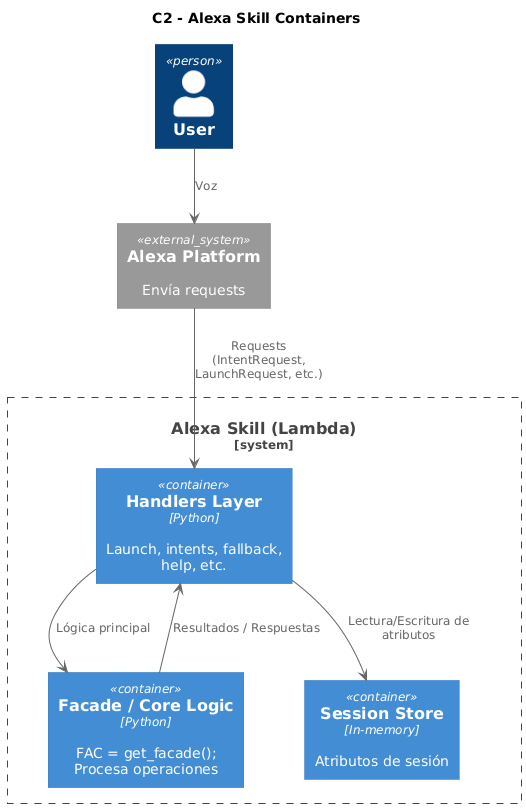
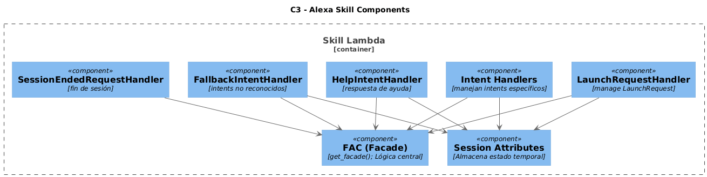
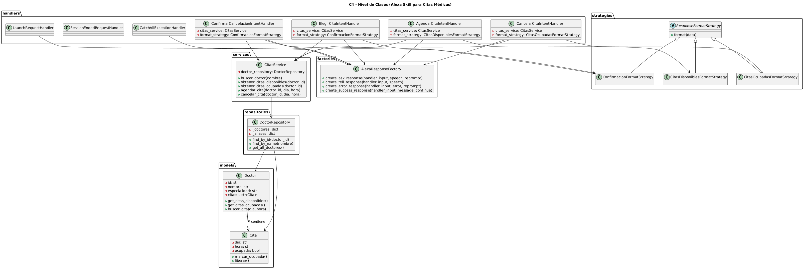

# Alexa Skill - Secretaria Virtual de Clínica
Skill de Alexa para gestionar citas médicas mediante comandos de voz. Permite agendar, cancelar y consultar información de doctores y citas.
## Descripción
Esta Alexa Skill actúa como una secretaria virtual para una clínica médica, permitiendo a los usuarios:

Agendar citas con doctores disponibles
Cancelar citas previamente agendadas
Consultar información de doctores específicos
Listar todos los doctores disponibles en la clínica

## Arquitectura y Patrones de Diseño
El proyecto implementa una arquitectura limpia basada en patrones de diseño y principios SOLID:
### Diagramas:
C1:

C2:

C3:

C4:

Patrones Implementados:
### Factory Method Pattern (factories/)

Clase: AlexaResponseFactory
Propósito: Centraliza la creación de respuestas de Alexa
Beneficio: Elimina código repetitivo y facilita el mantenimiento
Métodos:

create_ask_response() - Respuestas que esperan input del usuario
create_tell_response() - Respuestas que terminan la sesión
create_error_response() - Respuestas de error
create_success_response() - Respuestas de éxito

### Repository Pattern (repositories/)

Clase: DoctorRepository
Propósito: Abstrae el acceso a datos de doctores
Beneficio: Permite cambiar la fuente de datos (de memoria a DynamoDB) sin afectar la lógica de negocio
Métodos:

find_by_id() - Busca doctor por ID
find_by_name() - Busca doctor por nombre (incluye aliases)
get_all_doctores() - Retorna todos los doctores

### Strategy Pattern (strategies/)

Clase Base: ResponseFormatStrategy
Propósito: Define diferentes algoritmos para formatear respuestas
Beneficio: Permite cambiar el formato de respuesta sin modificar handlers
Estrategias:

CitasDisponiblesFormatStrategy - Formatea lista de citas disponibles con opciones A, B, C...
CitasOcupadasFormatStrategy - Formatea cita ocupada del usuario
ConfirmacionFormatStrategy - Formatea mensajes de confirmación
ConsultarInfoFormatStrategy - Formatea información de un doctor
ListarDoctoresFormatStrategy - Formatea lista de todos los doctores

## Principios SOLID

- Single Responsibility: Cada clase tiene una única responsabilidad
- Open/Closed: Abierto para extensión (nuevas estrategias), cerrado para modificación
- Liskov Substitution: Las estrategias son intercambiables
- Interface Segregation: Interfaces pequeñas y específicas
- Dependency Inversion: Los handlers dependen de abstracciones (service), no de implementaciones concretas

## Estructura del Proyecto
/
├── requirements.txt                    # Dependencias del proyecto
├── lambda_function.py                  # Punto de entrada de AWS Lambda
├── models/                             # Modelos de dominio
│   ├── __init__.py
│   ├── cita.py                         # Modelo Cita
│   └── doctor.py                       # Modelo Doctor
├── repositories/                       # Capa de acceso a datos
│   ├── __init__.py
│   └── doctor_repository.py            # Repository Pattern
├── services/                           # Lógica de negocio
│   ├── __init__.py
│   └── citas_service.py                # Facade para operaciones
├── strategies/                         # Strategy Pattern
│   ├── __init__.py
│   └── response_format_strategy.py     # Estrategias de formato
├── factories/                          # Factory Method Pattern
│   ├── __init__.py
│   └── response_factory.py             # Factory de respuestas
└── handlers/                           # Handlers de intents
    ├── __init__.py
    ├── launch_handler.py               # Handler de inicio
    ├── agendar_cita_handler.py         # Handler para agendar
    ├── elegir_cita_handler.py          # Handler para elegir opción
    ├── cancelar_cita_handler.py        # Handler para cancelar
    ├── confirmar_cancelacion_handler.py # Handler de confirmación
    ├── consultar_info_handler.py       # Handler de información
    ├── listar_doctores_handler.py      # Handler de listar
    └── common_handlers.py              # Handlers comunes

## Cómo Correr el Proyecto:
Prerrequisitos

Cuenta de Amazon Developer
Cuenta de AWS
Python 3.8 o superior (para testing local)

Opción 1: Deploy en Alexa Developer Console (Recomendado)
Paso 1: Crear la Skill

Ingresa a Alexa Developer Console
Click en "Create Skill"
Nombre: Mi Secretaria (o el que prefieras)
Idioma: Español (ES)
Modelo: Custom
Método de hosting: Alexa-hosted (Python)
Click en "Create skill"

Paso 2: Configurar el Modelo de Interacción

En el panel izquierdo, ve a "Interaction Model" → "JSON Editor"
Pega el contenido del archivo interaction_model.json (ver sección JSON al final)
Click en "Save Model"
Click en "Build Model" (espera a que termine)

Paso 3: Subir el Código

Ve a la pestaña "Code" en la parte superior
Crea la estructura de carpetas mostrada arriba
Copia el contenido de cada archivo Python
Asegúrate de incluir el archivo requirements.txt
Click en "Deploy" (espera a que termine el deployment)

Paso 4: Probar la Skill

Ve a la pestaña "Test" en la parte superior
Activa el testing cambiando "Off" a "Development"
Di o escribe: "abre mi secretaria"

Opción 2: Deploy Local con AWS Lambda
Paso 1: Instalar Dependencias
bash# Crear entorno virtual
python -m venv venv

# Activar entorno virtual
# En Windows:
venv\Scripts\activate
# En Linux/Mac:
source venv/bin/activate

# Instalar dependencias
pip install -r requirements.txt
Paso 2: Crear Paquete de Deployment
bash# Crear directorio para el paquete
mkdir package

# Instalar dependencias en el directorio
pip install -r requirements.txt -t package/

# Copiar el código al paquete
cp -r models repositories services strategies factories handlers lambda_function.py package/

# Crear archivo ZIP
cd package
zip -r ../alexa-skill-deployment.zip .
cd ..
Paso 3: Subir a AWS Lambda

Ingresa a AWS Lambda Console
Click en "Create function"
Nombre: alexa-skill-clinica
Runtime: Python 3.9
Click en "Create function"
En "Code source", click en "Upload from" → ".zip file"
Sube el archivo alexa-skill-deployment.zip
En "Runtime settings", Handler: lambda_function.lambda_handler
Copia el ARN de la función (lo necesitarás)

Paso 4: Configurar el Trigger de Alexa

En Lambda, ve a "Configuration" → "Triggers"
Click en "Add trigger"
Selecciona "Alexa Skills Kit"
Pega el Skill ID de tu Alexa Skill (lo encuentras en la Developer Console)
Click en "Add"

Paso 5: Conectar Lambda con Alexa

Regresa a Alexa Developer Console
Ve a tu skill → "Endpoint"
Selecciona "AWS Lambda ARN"
Pega el ARN de tu función Lambda
Click en "Save Endpoints"

🗣️ Comandos de Ejemplo
Iniciar la Skill

"Alexa, abre mi secretaria"
"Alexa, inicia mi secretaria"

Agendar Cita
Usuario: "agendar cita con Ramírez"
Alexa: "Perfecto, estas son las citas disponibles con Dra. Ramírez: 
        Opción A: lunes a las 1:00. Opción B: lunes a las 2:00..."
        
Usuario: "opción A"
Alexa: "Cita agendada con éxito el lunes a las 1:00. ¿Desea hacer algo más?"
Cancelar Cita
Usuario: "cancelar cita con Ramírez"
Alexa: "Tienes esta cita con Dra. Ramírez: lunes a las 1:00. 
        Para cancelarla di: sí quiero cancelar mi cita."
        
Usuario: "sí quiero cancelar mi cita"
Alexa: "La cita del lunes a las 1:00 ha sido cancelada. ¿Desea hacer algo más?"
Consultar Información
Usuario: "información del doctor Gómez"
Alexa: "Dr. Gómez es especialista en Cardiología. 
        Tiene 2 citas disponibles y 0 citas ocupadas."
        
Usuario: "qué doctores hay"
Alexa: "Tenemos los siguientes doctores disponibles: 
        Dra. Ramírez, especialista en Pediatría; 
        Dr. Gómez, especialista en Cardiología; 
        Dr. Hernández, especialista en Dermatología."
📦 Dependencias
ask-sdk-core==1.11.0
boto3==1.18.0
🩺 Doctores Disponibles

Dra. Ramírez - Pediatría

Citas: Lunes 1:00, Lunes 2:00, Miércoles 2:00

Dr. Gómez - Cardiología

Citas: Lunes 2:00, Miércoles 3:00

Dr. Hernández - Dermatología

Citas: Lunes 4:00, Miércoles 2:00

🔧 Configuración del Modelo de Interacción (JSON)
Los intents configurados en la skill:
Intents Principales

AgendarCitaIntent - Inicia el proceso de agendar una cita

Slot: doctor (tipo: DOCTOR_TYPE)

ElegirCitaIntent - Confirma la selección de una opción de cita

Slot: opcion (tipo: OPCION_CITA)

CancelarCitaIntent - Inicia el proceso de cancelación

Slot: doctor (tipo: DOCTOR_TYPE)

ConfirmarCancelacionIntent - Confirma la cancelación

Sin slots (usa confirmación por voz)

ConsultarInfoIntent - Consulta información de un doctor

Slot: doctor (tipo: DOCTOR_TYPE)

ListarDoctoresIntent - Lista todos los doctores

Sin slots

Slot Types

DOCTOR_TYPE: ramirez, gomez, hernandez (con sinónimos)
OPCION_CITA: a, b, c, d, e, f (con sinónimos)

## Testing
Testing Manual
Usa el simulador en la pestaña "Test" de Alexa Developer Console.
Testing por Voz
Si tienes un dispositivo Echo:

Ve a "Distribution" → "Availability" en la Developer Console
Tu skill estará disponible automáticamente en modo desarrollo
Simplemente di: "Alexa, abre mi secretaria"

# PROJECT GENERAL DATA
-

Estrcutura del código
-

Invocation name
-

AgendarCitaIntent
-

CancelarCitaIntent
-

ElegirCitaIntent
-

ConfirmarCancelacionIntent
-

Slot created
-

