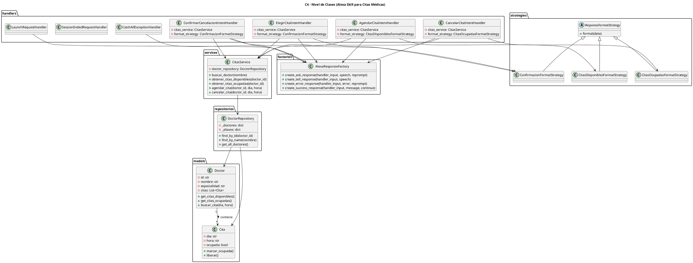

```plantuml
@startuml
title C4 - Nivel de Clases (Alexa Skill para Citas Médicas)

' ==== PAQUETES ====
package "models" {
    class Cita {
        - dia: str
        - hora: str
        - ocupada: bool
        + marcar_ocupada()
        + liberar()
    }

    class Doctor {
        - id: str
        - nombre: str
        - especialidad: str
        - citas: List<Cita>
        + get_citas_disponibles()
        + get_citas_ocupadas()
        + buscar_cita(dia, hora)
    }
}

package "repositories" {
    class DoctorRepository {
        - _doctores: dict
        - _aliases: dict
        + find_by_id(doctor_id)
        + find_by_name(nombre)
        + get_all_doctores()
    }
}

package "services" {
    class CitasService {
        - doctor_repository: DoctorRepository
        + buscar_doctor(nombre)
        + obtener_citas_disponibles(doctor_id)
        + obtener_citas_ocupadas(doctor_id)
        + agendar_cita(doctor_id, dia, hora)
        + cancelar_cita(doctor_id, dia, hora)
    }
}

package "strategies" {
    abstract class ResponseFormatStrategy {
        + format(data)
    }

    class CitasDisponiblesFormatStrategy
    class CitasOcupadasFormatStrategy
    class ConfirmacionFormatStrategy
}

ResponseFormatStrategy <|-- CitasDisponiblesFormatStrategy
ResponseFormatStrategy <|-- CitasOcupadasFormatStrategy
ResponseFormatStrategy <|-- ConfirmacionFormatStrategy


package "factories" {
    class AlexaResponseFactory {
        + create_ask_response(handler_input, speech, reprompt)
        + create_tell_response(handler_input, speech)
        + create_error_response(handler_input, error, reprompt)
        + create_success_response(handler_input, message, continue)
    }
}

package "handlers" {
    class LaunchRequestHandler
    class AgendarCitaIntentHandler {
        - citas_service: CitasService
        - format_strategy: CitasDisponiblesFormatStrategy
    }
    class ElegirCitaIntentHandler {
        - citas_service: CitasService
        - format_strategy: ConfirmacionFormatStrategy
    }
    class CancelarCitaIntentHandler {
        - citas_service: CitasService
        - format_strategy: CitasOcupadasFormatStrategy
    }
    class ConfirmarCancelacionIntentHandler {
        - citas_service: CitasService
        - format_strategy: ConfirmacionFormatStrategy
    }
    class SessionEndedRequestHandler
    class CatchAllExceptionHandler
}

' ==== RELACIONES ====

' Dominio
Doctor "1" --> "*" Cita : contiene >

' Repositorio → Dominio
DoctorRepository --> Doctor
DoctorRepository --> Cita

' Servicio → Repositorio
CitasService --> DoctorRepository

' Handlers → Servicio
AgendarCitaIntentHandler --> CitasService
ElegirCitaIntentHandler --> CitasService
CancelarCitaIntentHandler --> CitasService
ConfirmarCancelacionIntentHandler --> CitasService

' Handlers → Estrategias
AgendarCitaIntentHandler --> CitasDisponiblesFormatStrategy
CancelarCitaIntentHandler --> CitasOcupadasFormatStrategy
ElegirCitaIntentHandler --> ConfirmacionFormatStrategy
ConfirmarCancelacionIntentHandler --> ConfirmacionFormatStrategy

' Handlers → Factory
LaunchRequestHandler --> AlexaResponseFactory
AgendarCitaIntentHandler --> AlexaResponseFactory
ElegirCitaIntentHandler --> AlexaResponseFactory
CancelarCitaIntentHandler --> AlexaResponseFactory
ConfirmarCancelacionIntentHandler --> AlexaResponseFactory
CatchAllExceptionHandler --> AlexaResponseFactory

@enduml
```
